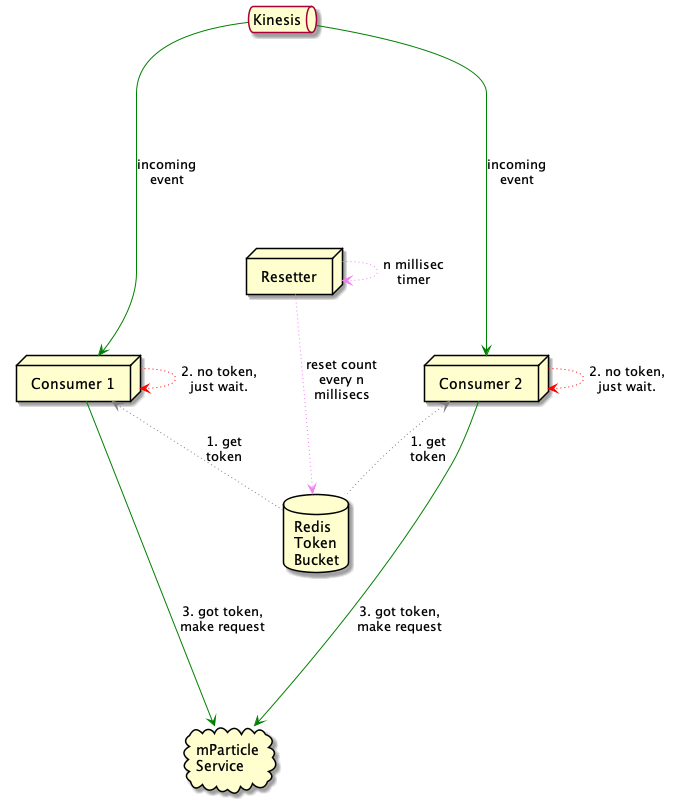
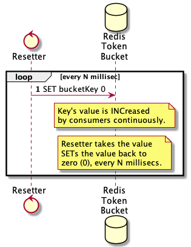
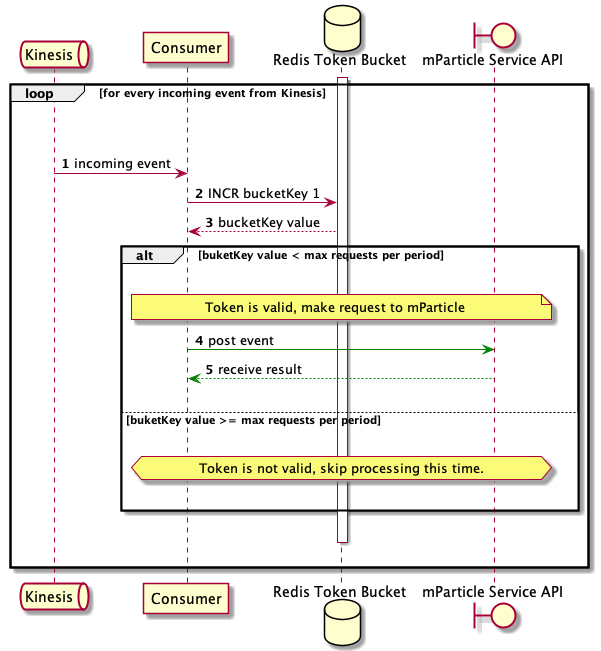
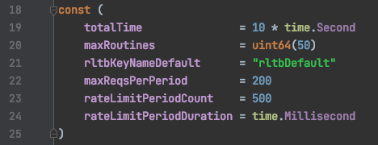
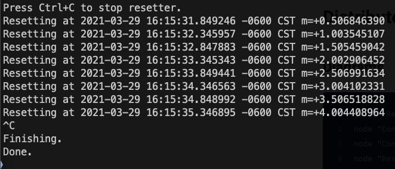
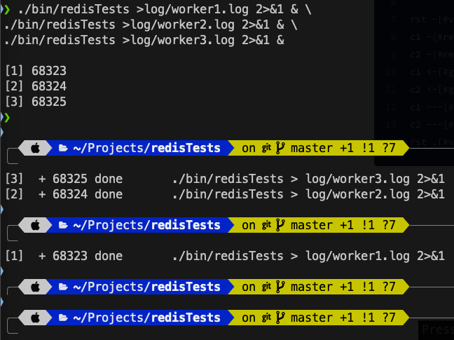
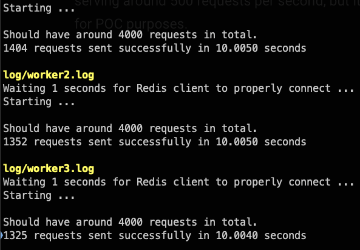

# Distributed Rate Limiting

The main idea is to have ***"client rate limiting"***, that is, continue to have multiple nodes making requests to a single resource, but observing a common, shared request rate limit.

## Actors & Participants

### Redis Token Bucket

A rate limiting token bucket in **Redis**, is basically a `key` holding an integer value.

This buckets initially start with a `0` value.

### Resetter

Multiple simple background worker nodes, in which only one is active through *"leader-election"*, elected leader will periodically *"reset"* a bucket stored in **Redis**, that is, set it to `0`.

### Consumers

Worker/consumer nodes, in this case, they would be `mparticle-sync` nodes that make requests to **mParticle**.

Consumers request a rate limiting token, if token is valid, make request to **mParticle**, otherwise, skip processing.

## How it works

A *rate limit bucket* is basically a counter in a ***Redis*** key, which is accessible from all consumers.

Whenever a consumer needs to make a request to an upstream service, it has to make a ***Redis*** `INCR` call to the corresponding bucket.

This call, will increase its value, and then give it back as the result value for the ***Redis*** call.

A ***maximum*** number of calls per a certain period of time is known and shared by all consumers.

If the value obtained from **Redis** is above the ***maximum***, the consumer is not allowed to make a request to the upstream service.

If the value is at or below the ***maximum***, the upstream requests is completed normally.

The ***Resetter*** process makes a `SET` call to **Redis** every `N` milliseconds, to set the bucket count back to zero (0).

This allows to continue making requests to the upstream service while keeping a limited rate of them as configured.

For **mParticle** case, you could have `30k max reqs per 1000ms`, `15k max reqs per 500ms`, or `10k per 330ms`, all of them would serve approximately the same effect, but benchmarks should be run to arrive to an optimum value.

Imagining an example of `10k max reqs per 1000ms`, might lead to making all `10k` requests within the first `100ms`, which could still cause issues, followed by `900ms` of idle time. It is possible that a configuration of `5k max reqs per 500ms` or other variant might be more appropriate.

### Deploy Spec

Consists of:

* Redis database holding token bucket(s). 
* Resetter process *"feeding"* `N` tokens every `M` milliseconds.
* Consumers getting tokens, and making requests to service if token was valid.

### Resetter Lifecycle

Simply goes and resets to zero (0) the count of requests since last reset.

This *"Reset"* process runs every `M` milliseconds.

### Consumer Lifecycle

Makes a request to upstream service, **ONLY** if it was able to fetch a "*valid*" token.

Every request for the *token*, increases its value.

In this example, a *"valid"* token is one that is *below* a maximum number of requests per a certain period of time.

If the token retrieved is greater than said maximum, no processing is done.

## Proof Of Concept

### Configuration

This is the configuration used for this POC, it shows a rate limit of approximately `200 max reqs per 500ms`.

A **Redis** key name of `"rltbDefault"`, `50` ***goroutines*** per process spawned, and the test will run for a total of `10 seconds`.

### Resetter

Here you can see a sample run of a resetter running every `500ms`.

### Consumers

Here 3 workers are launched, each one of them logging to its own log file.

Each of this 3 workers have a pool of 50 go routines making simultaneous requests to the upstream service.

The upstream service is a simple, local [json-server](https://www.npmjs.com/package/json-server) simply returning `{ "status": "ok" }` for every request,
yet, it has a limit on the laptop used for testing, of serving around 500 requests per second, but it's enough for POC purposes.

### Results

This shows an example of a test run. It shows a few messages, but the most important to notice is that, given the current rate limit configuration, it says `Should have around 4000 requests in total.`.

The sum of `1404` +`1352` +`1325` yields `4081` total requests in `~10s`, which is approximately the requested rate limit of `200 max reqs per 500ms` (which is 400 per second, and 4000 per 10 seconds) in the sample configuration.

